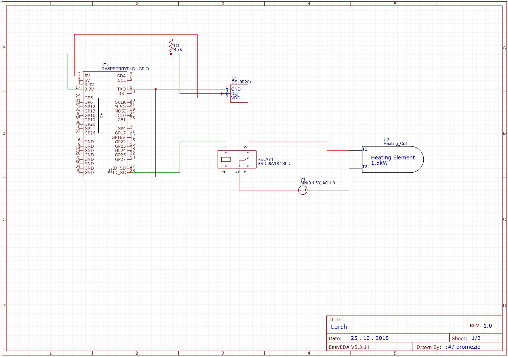
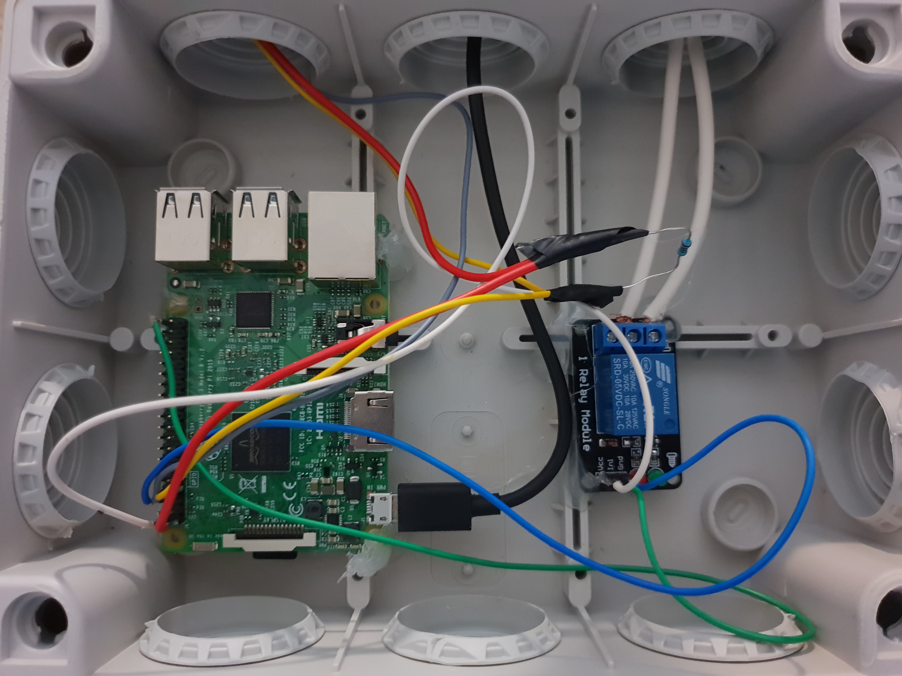

# :#/ Lurch
### Solar water heating managemant via Raspberry PI 3


## How To Use Lurch
Lurch is almost ready for use out-of-the-box. To use it simply wire the hardware, install the required libraries and then start the Flask webserver.

1. Wire the hardware (instruction below)
1. Install required library with this commands:
    ```
    sudo pip3 install w1thermsensor
    sudo pip3 install flask
    ```
1. Download & Unzip the source code in a folder
1. Open the folder in a terminal
1. Start the Flask webserver with this commands:
    ```
    export FLASK_APP=lurch.py
    sudo flask run
    ```
1. Open a browser at 127.0.0.1:5000
1. __Enjoy Lurch!__


## Hardware requirements
* Raspberry PI 3
* Temperature sensor DS18B20 
* Single 5V Rele module jqc-3ff
* Heating Element 220V 1500W

## Hardware scheme


* PIN 1  -> 3.3v VCC DS18B20
* PIN 2  -> 5v VCC SRD-05VDC-SL-C
* PIN 6  -> GND DS18B20 + GND SRD-05VDC-SL-C
* PIN 7  -> LN DS18B20
* PIN 40 -> LN1 SRD-05VDC-SL-C

## Software requirements
* Click==7.0
* Flask==1.0.2
* itsdangerous==0.24
* Jinja2==2.10
* MarkupSafe==1.0
* pkg-resources==0.0.0
* w1thermsensor==1.1.2
* Werkzeug==0.14.1





Powered by [:#/promezio](https://promezio.it).
Released under GPL 3.0 license.
